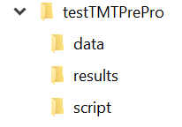

TMTPreProV2 Scripts Basic Tutorial
================
11 March, 2022

# About

  - TMTPrePro is a set of R scripts we developed at the Australian
    Proteome Analysis Facility several years ago, for the analysis of
    TMT data.
  - The reference can be found
    **[here](https://link.springer.com/protocol/10.1007/978-1-4939-6740-7_5)**
  - There is an original **[Github
    site](https://github.com/APAFbioinformatics/TMTPrePro)** where a
    first version of the code was placed, but it is no longer actively
    maintained.

# Install

  - First, install R from your favourite repository (tested in R 4.0.2)
  - Install the several needed packages as below

> install.packages(“heatmap3”, “openxlsx”,“scatterplot3d”, “limma”,
> “lattice”, “tools”)

# Running the scripts

There are two main scripts, one containing the basic flow, and the
others containing several standalone functions, such as the one needed
for IRS normalisation.

  - On your computer, create a test folder, e.g. “C:/testTMTPrePro”
  - Inside it, create subfolders script, results and data
    
  - Place the scripts provided here (functions.R and TMTPrePro.R) inside
    the scripts folder
  - Change the initial “setwd” command to reflect the results folder you
    created, for instance:

> setwd(“C:/testTMTPrepro/results”)

# Input data

TMTPrePro needs two data inputs: the zip file containing all the
ProteomeDiscoverer files, and the design telling it what comparison to
carry out.  
An example design is included in the data folder.

  - Place your data and design in the data folder
  - Make sure that the params tab shows the names of the files in the
    zip, and the respective reference
  - Make sure the comparison tab lists all the comparisons of interest
  - Make sure the design shows the replicate and the group for each of
    the files
  - The order of the columns in tab 1 is the same as the order of the
    tabs in tab 2
  - The name of the comparison groups in tab 3 should be the same as the
    group names in tab 1

# Parameter setting

The early part of the script sets the parameters needed.

  - zipfname: change to reflect the name of your zip file
  - designfname: change to reflect the name of your design file
  - FCCutoff: often 1.2
  - PvalCutoff: usually 0.05
  - MasterFilter: this is usually either "IsMasterProtein", or "Master Protein" depending on your Proteome Discoverer files 
  - KeepREF - false if you want to drop the common reference
  - CountsCutoff: only set if you want to filter based on peptide counts

# Sample Run

  - Step through the code, checking for any errors.
  - The run should generate several images and spreadsheets outputs
    included 

# Troubleshooting

Common errors come from

  - Incorrect design
  - Slightly different data format for the ProteomeDiscoverer files
